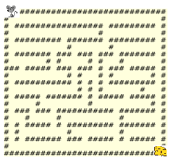
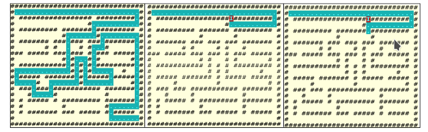

# algoritmo_busqueda_retroceso

Algoritmo de búsqueda con retroceso para encontrar la salida de un laberinto.  
  
  
El algoritmo encuentra un camino desde la esquina superior izquierda hasta la esquina inferior
derecha del laberinto, mientras se recorre un camino con obstáculos (muros).

 
~~~
' ' indica posición libre
 #   indica posición con muro
 .   indica camino
 I   indica posición visitada que no llevó a solución
~~~
 
~~~
a) Camino encontrado            b)Caso retroceso          c) Búsqueda otro camino
~~~
---
## compilación y ejecución algoritmo  
1. Ejecuta el comando `make`para generar el fichero ejecutable "mainLab".  
2.A Ejecuta `./mainLab datos/lab1.txt` para usar un laberinto predefinido del directorio datos/  
2.B Ejecuta `./mainLab alto ancho densidad`donde:  
      * alto: entero que indica la altura del laberinto.  
      * ancho: entero que indica la anchura del laberinto.  
      * densidad: real entre [0,1], que indica la densidad del laberinto.  
   
 Ejemplo: ./mainLab 25 25 0.4  
   
 3. Para eliminar ficheros .o y ejecutable `make clean`
